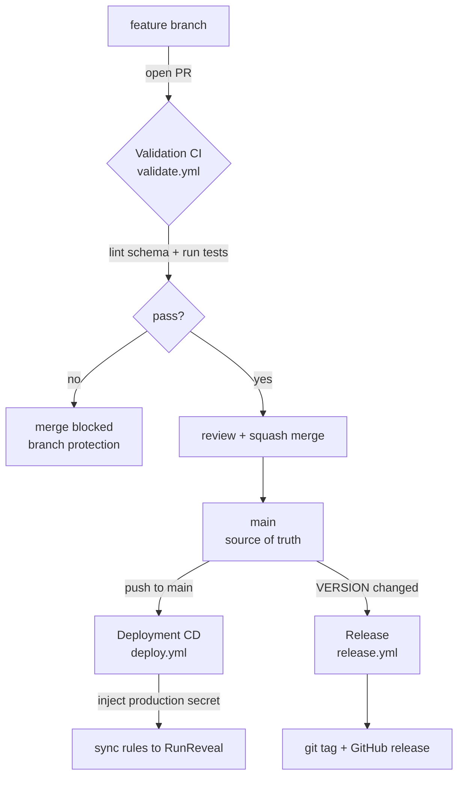

# Detection-as-Code CI/CD Pipeline


Security detection rules managed the way software is managed: version
controlled in Git, changed through pull requests, tested automatically, and
deployed to production without anyone editing a console by hand. The design
follows the [RunReveal Detection-as-Code guide](https://blog.runreveal.com/runreveal-detection-cicd-guide/)
and borrows conventions from the Sigma and Elastic detection projects.

## Why this exists

The traditional way to manage SIEM rules is to log into a web console and edit
them by hand. That approach has no change history, no review step, and no test
before a rule goes live. A typo can silently disable a critical rule, and a
too-broad rule can bury analysts in false positives. Nobody can answer "who
changed this, when, and why?"

Detection-as-Code treats a detection rule as source code. Every change is a
commit with an author and a reason. Every change is reviewed and tested before
it reaches production. If a rule breaks something at 3 a.m., the on-call analyst
reads the git history, sees the reasoning in the pull request, and reverts it in
one step.

## Architecture

The repository is the single source of truth. Two pipelines sit on top of it,
separated by a trust boundary: validation runs on untrusted pull-request code
with no production access, while deployment runs on reviewed code that has been
merged to `main`.



The two triggers carry different privilege levels. `pull_request` code is not
yet trusted, so the validation pipeline has no secrets and cannot touch
production. `push` to `main` means the code already passed review and CI, so the
deployment pipeline is allowed to read the production token from a scoped
environment secret. Same trust boundary, two sides.

## Repository layout

```
detection-as-code/
├── .github/workflows/
│   ├── validate.yml        # CI: lint + test on every pull request
│   ├── deploy.yml          # CD: sync rules to production on merge to main
│   └── release.yml         # tag + GitHub release when VERSION changes
├── detections/
│   ├── sql/                # RunReveal-style SQL detections, grouped by log source
│   │   └── aws/
│   └── sigma/              # portable, platform-agnostic Sigma rules
├── tests/datasets/         # synthetic log events with expected match/no-match
├── scripts/
│   ├── validate_rules.py   # schema + policy validation
│   ├── test_rules.py       # behavioural unit tests
│   └── deploy_rules.py     # deployment tool (dry-run by default)
├── docs/runbook.md         # operational procedures
├── VERSION                 # current rule-set version (SemVer)
├── CHANGELOG.md            # human-readable change history
└── requirements.txt        # pinned Python dependencies
```

Rules are grouped by log source (`aws`, `okta`, ...) because a detection is
written against a specific source's schema. MITRE ATT&CK coverage is tracked in
each rule's metadata rather than by folder, so the same rule can be found both
ways.

## How a detection is structured

Each rule is a single YAML file holding both the query and its metadata, so the
two can never drift apart. A SQL detection looks like this:

```yaml
id: aws-console-login-no-mfa
name: AWS Console Login Without MFA
description: >
  Detects successful AWS console logins by IAM users without MFA.
  Federated/SSO logins are excluded because their MFA is enforced
  at the identity provider.
severity: high
status: experimental
mitre_attack:
  tactic: TA0001
  technique: T1078.004
false_positives:
  - Break-glass emergency accounts intentionally exempt from MFA
query: |
  SELECT eventTime, userIdentity.userName AS user_name, sourceIPAddress AS source_ip
  FROM aws_cloudtrail
  WHERE eventName = 'ConsoleLogin'
    AND responseElements.ConsoleLogin = 'Success'
    AND additionalEventData.MFAUsed != 'Yes'
    AND userIdentity.type = 'IAMUser'
```

The `false_positives` and exclusion reasoning matter as much as the query: they
tell the on-call analyst why the rule fires and when it can be safely dismissed.
Every rule ships with a Sigma equivalent under `detections/sigma/` for
portability across SIEM platforms, and a test dataset under `tests/datasets/`.

## Local development

```bash
git clone https://github.com/yigitdayoglu/detection-as-code.git
cd detection-as-code
python3 -m venv .venv
source .venv/bin/activate
pip install -r requirements.txt

python scripts/validate_rules.py   # schema + policy checks
python scripts/test_rules.py       # behavioural tests against datasets
python scripts/deploy_rules.py     # dry-run: shows what would deploy
```

The same two commands the CI runs are the ones you run locally, so you can see a
green result before opening a pull request.

## Contributing workflow

`main` is protected: no direct pushes (not even for admins), and the `validate`
check must pass before a pull request can merge.

```bash
git switch -c feature/my-new-rule
# add the rule, its Sigma equivalent, and a test dataset
python scripts/validate_rules.py && python scripts/test_rules.py
git commit -am "feat: add my new detection"
git push -u origin feature/my-new-rule
gh pr create
```

Once CI is green and the pull request is reviewed, squash-merge it. The merge
triggers deployment automatically.

## Deployment and secrets

On merge to `main`, `deploy.yml` runs against a GitHub `production` environment.
The RunReveal API token lives in that environment as a secret, is injected into
the job at runtime, and is masked in logs. It never appears in source code. To
actually push changes, the deploy tool requires the `--apply` flag; its default
is a dry run.

## Versioning and releases

The rule set is versioned with [Semantic Versioning](https://semver.org/) in the
`VERSION` file: a new detection is a MINOR bump, a fix is a PATCH, and a breaking
change to the pipeline or schema is a MAJOR bump. Bumping `VERSION` in a merged
pull request triggers `release.yml`, which creates the matching git tag and a
GitHub release. Changes are recorded in [CHANGELOG.md](CHANGELOG.md).

## Rollback

Because production mirrors `main`, rolling back a bad rule is a git operation:
revert the offending merge through a pull request, and the deployment pipeline
re-syncs production to the reverted state. See [docs/runbook.md](docs/runbook.md)
for the full procedure.

## Scope and limitations

This is a portfolio project, and two boundaries are drawn on purpose:

- **The RunReveal sync is stubbed.** `deploy_rules.py` reads the token, iterates
  the rules, and reports per-rule results exactly like a real deployment, but the
  network call is a placeholder because the project ships no real credentials.
  Swapping in a live API call is a one-line change.
- **The test runner simulates detection logic in Python.** It evaluates the
  subset of SQL the rules use (a `WHERE` clause of `AND`-joined equality and
  inequality checks) rather than running a real ClickHouse engine. It tests the
  rule logic, not the query engine.
